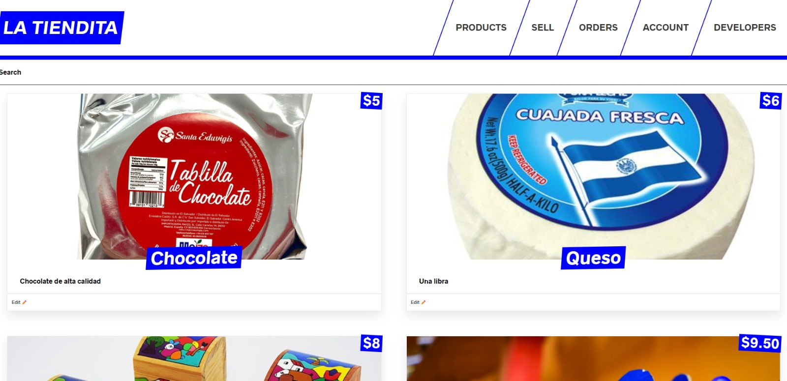

<a name="readme-top">Full Stack Application</a>

<div align="center">
  
  <br/>

  <h3><b>Full Stack App</b></h3>

</div>

<!-- TABLE OF CONTENTS -->

# 📗 Table of Contents

- [📗 Table of Contents](#-table-of-contents)
- [📖 La Tiendita ](#-la-tiendita-)
  - [🛠 Built With ](#-built-with-)
    - [Tech Stack ](#tech-stack-)
    - [Key Features ](#key-features-)
  - [🚀 Live Demo ](#-live-demo-)
  - [💻 Getting Started ](#-getting-started-)
    - [Prerequisites](#prerequisites)
    - [Setup](#setup)
    - [Install](#install)
    - [Usage](#usage)
    - [Run tests](#run-tests)
    - [Deployment](#deployment)
  - [👥 Authors ](#-authors-)
  - [🔭 Future Features ](#-future-features-)
  - [🤝 Contributing ](#-contributing-)
  - [⭐️ Show your support ](#️-show-your-support-)
  - [🙏 Acknowledgments ](#-acknowledgments-)
  - [❓ FAQ (OPTIONAL) ](#-faq-optional-)
  - [📝 License ](#-license-)

<!-- PROJECT DESCRIPTION -->

# 📖 La Tiendita <a name="about-project"></a>

> This is a full stack web aplication

**[La Tiendita]** is an online store in which you can buy or sell products.

## 🛠 Built With <a name="built-with"></a>

### Tech Stack <a name="tech-stack"></a>

<details>
  <summary>Client</summary>
  <ul>
    <li><a href="https://reactjs.org/">React.js</a></li>
    <li><a href="https://developer.mozilla.org/en-US/docs/Web/CSS">CSS</a></li>
    <li><a href="https://developer.mozilla.org/en-US/docs/Learn/JavaScript">JavaScript</a></li>
    <li><a href="https://www.apollographql.com/docs/react/">Apollo Client</a></li>
  </ul>
</details>

<details>
  <summary>Server</summary>
  <ul>
    <li><a href="https://nextjs.org/">Next.js</a></li>
    <li><a href="https://graphql.org/">GraphQL</a></li>
    <li><a href="https://nodejs.org/en/">Node.js</a></li>
    <li><a href="https://keystonejs.com/">Keystone.js</a></li>
  </ul>
</details>

<details>
<summary>Database</summary>
  <ul>
    <li><a href="https://www.mongodb.com/">MongoDB</a></li>
  </ul>
</details>

<!-- Features -->

### Key Features <a name="key-features"></a>

- **[Charging credit card with Stripe]**
- **[Performing authentication]**
- **[Next.js for server side rendering]**

<p align="right">(<a href="#readme-top">back to top</a>)</p>

<!-- LIVE DEMO -->

## 🚀 Live Demo <a name="live-demo"></a>

> It will be vailable soon!!!!!!.

- [Live Demo Link]()

<p align="right">(<a href="#readme-top">back to top</a>)</p>

<!-- GETTING STARTED -->

## 💻 Getting Started <a name="getting-started"></a>

> How to run this project

To get a local copy up and running, follow these steps.

### Prerequisites

In order to run this project you need:

```
Node.js version 16.9.0
React 17.0
```

### Setup

Clone this repository to your desired folder:

```
Using Https:
  https://github.com/Alejandroq12/full-stack-application.git
```

### Install

Install this project with:

Go to folder /backend and run:
```
 npm install
 npm run dev
```

Go to folder /frontend and run:
```
 npm install
 npm run dev
```

### Usage

To run the project, execute the following command:

Go to folder /backend and run:
```
 npm run dev
```

Go to folder /frontend and run:
```
 npm run dev
```

### Run tests
```
They will be available soon!!
```
<!--
Example command:

```sh
  bin/rails test test/models/article_test.rb
```
--->

### Deployment

```
It will be available soon!!
```
<!--
Example:

```sh

```
 -->

<p align="right">(<a href="#readme-top">back to top</a>)</p>

<!-- AUTHORS -->

## 👥 Authors <a name="authors"></a>


👤 **Author1**

- GitHub: [@Alejandroq12](https://github.com/Alejandroq12)
- Twitter: [@JulioAle54](https://twitter.com/JulioAle54)
- LinkedIn: [Julio Quezada](https://www.linkedin.com/in/quezadajulio/)

👤 **Author2**

- GitHub: [@DamarisCaballero](https://github.com/DamarisCaballero)
- LinkedIn: [Damaris de Quezada](https://www.linkedin.com/in/damaris-de-quezada/)

<p align="right">(<a href="#readme-top">back to top</a>)</p>

<!-- FUTURE FEATURES -->

## 🔭 Future Features <a name="future-features"></a>

- [ ] **[I will be a real store]**
- [ ] **[I will make posible to group products by category]**
- [ ] **[I will deploy this app with a personalized domain]**

<p align="right">(<a href="#readme-top">back to top</a>)</p>

<!-- CONTRIBUTING -->

## 🤝 Contributing <a name="contributing"></a>

Contributions, issues, and feature requests are welcome!

Feel free to check the [issues page](../../issues/).

<p align="right">(<a href="#readme-top">back to top</a>)</p>

<!-- SUPPORT -->

## ⭐️ Show your support <a name="support"></a>

> Hello, there..

If you like this project please give me a star.

<p align="right">(<a href="#readme-top">back to top</a>)</p>

<!-- ACKNOWLEDGEMENTS -->

## 🙏 Acknowledgments <a name="acknowledgements"></a>

> Inspired by...

I would like to thank Kodigo because this boot camp is challenging me to learn programming.

<p align="right">(<a href="#readme-top">back to top</a>)</p>

<!-- FAQ (optional) -->

## ❓ FAQ (OPTIONAL) <a name="faq"></a>

- **[Do I have to use Node.js version 16.9.0?]**

  - [Yes, because some dependencies are not compatible with recent versions.]

- **[Do I have to configure MongoDB?]**

  - [Yes, specially if you want to have your data on the cloud. But you can also use Mongo Compass in case you want to have your data locally.]

<p align="right">(<a href="#readme-top">back to top</a>)</p>

<!-- LICENSE -->

## 📝 License <a name="license"></a>

This project is [MIT](./LICENSE) licensed.


<p align="right">(<a href="#readme-top">back to top</a>)</p>

